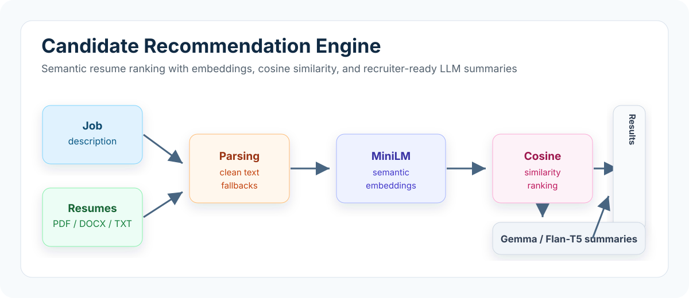

# Candidate Recommendation Engine

Candidate Matcher is an ATS-style Streamlit application that ranks candidate resumes against a job description using semantic similarity and generates concise recruiter-facing summaries.

The project combines resume parsing, sentence-transformer embeddings, cosine similarity ranking, and LLM-based summarization into a practical workflow for screening multiple candidates from a single interface.



## Features

- Upload multiple resumes in PDF, DOCX, or TXT format.
- Paste a job description and optional role metadata such as department, experience level, and location.
- Extract resume text with file-type specific parsers and text-cleaning fallbacks.
- Embed the job description and resumes with `sentence-transformers/all-MiniLM-L6-v2`.
- Rank candidates using cosine similarity over normalized semantic embeddings.
- Generate 2-3 sentence recruiter summaries with Gemma 2B IT and a Flan-T5 fallback.
- Review ranked results in a wide Streamlit UI with full summary text and CSV export.
- Optionally expose the matching workflow through a lightweight FastAPI endpoint.

## How It Works

1. **Resume parsing** - `modules/resume_parser.py` extracts text from PDF, DOCX, and TXT files and normalizes noisy text.
2. **Embedding** - `modules/embedder.py` loads MiniLM once and converts the job description and resume text into dense vectors.
3. **Matching** - `modules/matcher.py` computes cosine similarity and sorts candidates from strongest to weakest match.
4. **Summarization** - `modules/summarizer.py` prompts an LLM to produce a concise, role-specific summary of candidate fit.
5. **Presentation** - Streamlit views display the ranked candidates, scores, summaries, settings, and CSV download.

## Repository Structure

```text
candidate-matcher/
|-- app.py                    # Streamlit app entry point and router
|-- backend/
|   `-- main.py               # Create Match UI and optional FastAPI service
|-- components/
|   `-- sidebar.py            # Horizontal navigation component
|-- modules/
|   |-- embedder.py           # Sentence Transformer embedding loader
|   |-- matcher.py            # Resume ranking pipeline
|   |-- resume_parser.py      # PDF, DOCX, TXT parsing utilities
|   |-- summarizer.py         # Gemma / Flan-T5 summary generation
|   `-- utils.py              # Cosine similarity and table helpers
|-- views/
|   |-- dashboard.py          # Dashboard page
|   |-- results.py            # Ranked results and CSV export
|   `-- settings.py           # User settings
|-- sample_resumes_pdf/       # Small sample resumes for testing
|-- requirements.txt
|-- secrets.example.toml      # Streamlit secrets template
`-- README.md
```

## Tech Stack

| Area | Tools |
|---|---|
| App UI | Streamlit, streamlit-option-menu |
| Backend/API | Python, FastAPI, Pydantic |
| Resume parsing | pdfminer.six, python-docx |
| Embeddings | Sentence Transformers, MiniLM-L6-v2 |
| Similarity | Cosine similarity with NumPy |
| Summaries | Hugging Face Transformers, Gemma 2B IT, Flan-T5 fallback |
| Deployment | Streamlit Cloud with secrets management |

## Setup

```bash
git clone https://github.com/jaypolra/candidate-matcher.git
cd candidate-matcher

python -m venv .venv
source .venv/bin/activate      # macOS/Linux
# .venv\Scripts\activate       # Windows PowerShell

pip install -r requirements.txt
```

## Configure Secrets

The summarizer expects a Hugging Face token through Streamlit secrets. Use `secrets.example.toml` as a template and create `.streamlit/secrets.toml` locally, or configure the same key in Streamlit Cloud:

```toml
HF_TOKEN = "your_hugging_face_token"
```

Do not commit real tokens to the repository.

## Run the Streamlit App

```bash
streamlit run app.py
```

Then open the local Streamlit URL, paste a job description, upload resumes, and submit the match.

## Optional API

`backend/main.py` also exposes a lightweight FastAPI service for programmatic matching.

```bash
uvicorn backend.main:app --reload
```

The API accepts base64-encoded resume files at `POST /match` and returns ranked results.

## Design Decisions

- **Cosine similarity** is used because ranking should depend on semantic direction rather than vector magnitude.
- **MiniLM-L6-v2** keeps embedding latency low while preserving useful semantic matching quality.
- **LLM fallback behavior** improves reliability in constrained environments where Gemma may not load.
- **Session state** keeps Streamlit navigation, settings, and results stable across views.
- **Full-width result tables** make recruiter summaries readable without clicking into each row.

## Limitations

- Linear similarity search is fine for small batches but will not scale efficiently to very large resume pools.
- PDF extraction can fail on scanned or image-only resumes without OCR.
- Summary quality depends on the selected LLM, prompt quality, and available compute.
- The current ranking is semantic-only and does not yet combine keyword, skill taxonomy, or structured experience signals.

## Future Improvements

- Add FAISS or another vector database for scalable nearest-neighbor search.
- Add cross-encoder re-ranking for higher precision on top candidates.
- Combine semantic similarity with keyword and skill-based matching.
- Add OCR support for scanned resumes.
- Add evaluation examples with labeled job-candidate fit pairs.
